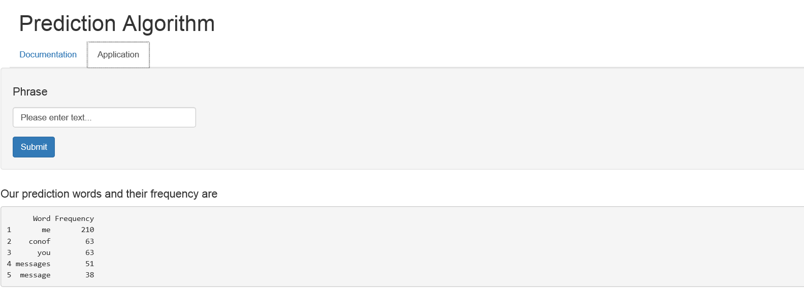

"The Prediction Algorithm" Shiny App
========================================================
author: Andrii Daniliuk
date: April 18th 2015
transition: rotate


General overview
========================================================

As a part of the Data Science Capstone Session the 
task was to create a prediction text product based on 
the data provided by **SwiftKey**, corporate partner in
the Capstone.

The provided algorithm represents a natural language 
processing (*NLP* ) model which predicts the most probable 
word to be typed next, based on analysis of a large set 
of raw text.

The application takes a phrase (multiple words) in a text 
box input as input and outputs a prediction of the next 
word (we provide five words which could follow your phrase
to choose).


Main function
========================================================

Based on `ngram` structures which were received from text 
datasets of twitter, news and blog messages in English 
(approx. 580 MB of data) we may predict which word appears 
next after one/two/three/…/n ones before it with a certain 
probability ([Katz back-off model](http://en.wikipedia.org/wiki/Katz%27s_back-off_model)
is used).


```r
quintgrams<-readRDS("quintgrams.RDS")
head(quintgrams,5)
```

```
                  Word TotalFrequency
1    at the end of the            323
2    it is going to be            242
3     is going to be a            213
4 in the middle of the            182
5    i am not going to            147
```


The shiny application
========================================================

For creating the algorithm we used such R packages as `dplyr`,
`tm`, `RWeka` (creating `ngrams`); `ggplot2` and `gridExtra`
(visualisation phase of the project).

The Algorithm consists of two parts - `Documentation` (with the 
manual) and `Application` itself:




Summary
========================================================

- [The Prediction Algorithm](https://andreydan.shinyapps.io/capst_pred_alg) 
is available online as [Shiny](shiny.rstudio.com) app
- You may also get acquainted with [the Milestone Report](http://rpubs.com/andreydan/69415)
showing the steps made from downloading raw data until 
`ngrams` were created
- If required by the interested investors/sponsors the 
product may upgraded with corresponding visualization
effects (as `wordcloud` etc.), which are not available
due to space and time processing reasons

**Thanks for your attention and take care! ☻**
